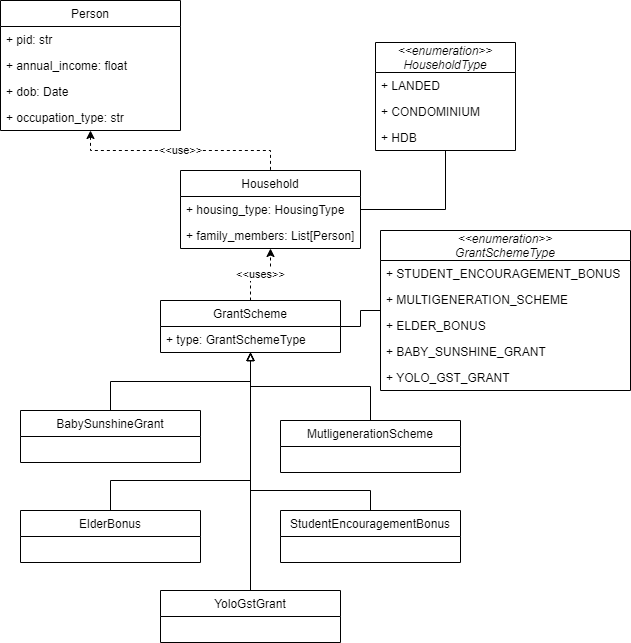

# TAP-2023-Div-Tech-Assessment-Meteor-Backend
This is the repository for the meteor tech assessment, specifically the backend

## Architecture:
- Database: Postgresql
- Backend: Flask 

## Class diagram:

## Assumption
1. Time is static, i.e. the age of the person added won't change. 
2. A person can only be a family member of one household.
3. We are more likely to query for the eligible household members than adding family members. 
    - We will update the eligible members when a person is added rather than when `/grant_schemes/grant` endpoint is queried.
## Set up
1. Install Postgres. 
    - Link: https://www.postgresqltutorial.com/postgresql-getting-started/install-postgresql/
2. Install Python 3
    - Link: https://realpython.com/installing-python/ 
3. Install Pip
    - Link: https://pip.pypa.io/en/stable/installation/ 
4. Install Flask and psycopg2-binary
    - ```
      pip install Flask psycopg2-binary
5. Clone this repository
6. Open psql terminal and login
7. Create a database for this repository
    - ```
      CREATE DATABASE tap_meteor;
8. Create a user with full access to the database
    - ```
      CREATE USER dev WITH PASSWORD 'password';
9. Grant the user all administrative access
    - ```
      GRANT ALL PRIVILEGES ON DATABASE tap_meteor TO dev;
10. Ensure that the database and user are created before quitting the terminal.
11. In the repository directory, export the username and password for the database
    - ```
      export DB_USERNAME="dev" && export DB_PASSWORD="password"
12. Next, run init_db.py
    - ```
      python init_db.py
    - The python script contains the database schema and sample inputs.
13. To run the Flask app, run
    - ```
      export FLASK_APP=./controller/index.py
      export FLASK_ENV=development
## All Endpoints:
| Endpoint | Method | Description | Parameters
| --- | --- | --- | --- |
| /households | GET |list all households with family members |
| /households/id | GET |get the specific household with the input id |
|  /grant_schemes/grant | GET | get the household members who are eligible for the grant |
| /create_household | POST | create household. | housing_type = landed/condominium/hdb
| /household/id | POST | adds family member to the household with the id | pid = person's id; gender = male/female/other/prefer not to say; marital_status = single/married/widowed/separated/divorced/others; occupation_type = unemployed/student/employed; dob[date of birth] = YYYY-MM-DD; OPTIONAL: spouse = id of the spouse; OPTIONAL: annual_income must be larger than 0 if included. 
    